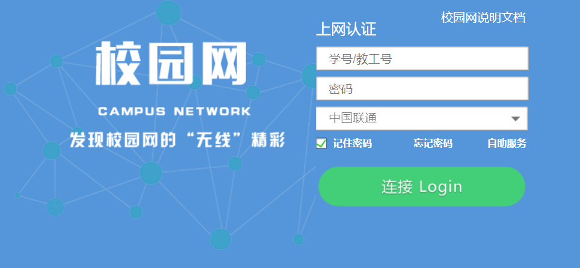

# school-toolbox
**some scripts, which make me easy to get school service.**

### Campus Network Tool

- 学校周一到周五每天晚上11点半都会断电，隔天起来还得先给路由器弄个上网认证才能用，太麻烦了。所以便有了这个工具，将它部署在树莓派上，树莓派连接路由器WiFi，这样每天早上就免去手动认证的麻烦了。宿舍如果有多余的网线接口，也可以直接接到树莓派上，通过这个脚本自动认证。
  
  `注：并非一定要用树莓派，路由器、PC都可以只要能运行Python3`

- 使用方法 : 
  
  `python3 conn.py -h` 查看详细的使用帮助。
    
  连接网络 `python3 conn.py -i [学号] -p [密码] -s [网络服务商]` (网络服务商默认是联通)。

  断开连接 `python3 conn.py -q` 也可以在连接网络时加上`-q`，这样会先断开现有网络然后连接。

  通过 `supervisor` 部署，实现断网自动重连。

  这里以 `Ubuntu` 为例，supervisor详细的使用方法不做说明。

  `apt install supervisor`

  `nano /etc/supervisor/conf.d/CampusNetwork.conf`

  ```
  [program:CampusNetwork] 
  command=python3 conn.py -i 学号 -p 密码 -l # 可选 -t [每几秒检查一次网络状态]
  directory=/home/share/ # conn.py所在的目录
  user=root
  autostart=true
  autorestart=true
  stopasgroup=true
  killasgroup=true
  ```

  `supervisorctl reload`
  
  然后就可以尝试着把网线拔掉重接，看看有没有自动认证了。默认每 `300s` 检查一次，可自行调整。
  
- 如果刚好这么巧，你的校园网登录界面和下面的长得一模一样，后台IP地址是`10.100.1.5`的话可以试试看。

  