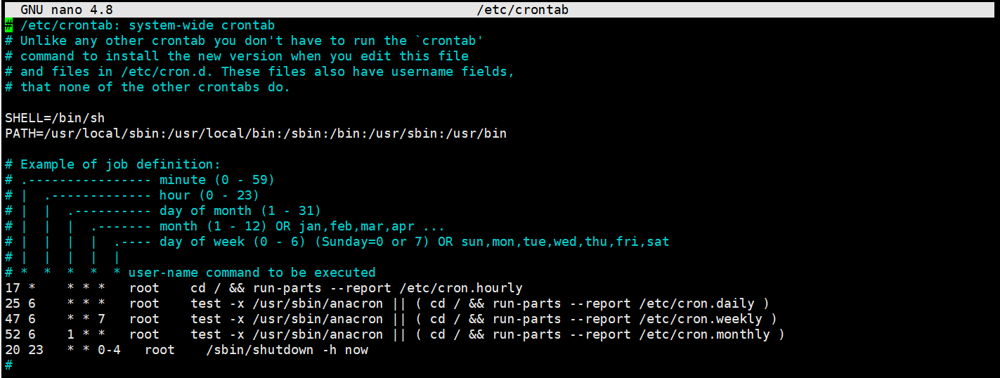

# school-toolbox

**some scripts, which make me easy to get school service.**

### Campus Network Tool

学校周一到周五每天晚上11点半都会断电，隔天起来还得先给路由器弄个上网认证才能用，太麻烦了。所以便有了这个工具，将它部署在树莓派上，树莓派连接路由器WiFi，这样每天早上就免去手动认证的麻烦了。宿舍如果有多余的网线接口，也可以直接接到树莓派上，通过这个脚本自动认证。

`注：并非一定要用树莓派，只要能运行 Python3 或 shell 脚本的设备都可以。`

#### 方案一 : OpenWrt Ash

- 使用方法 :

  `chmod +x conn.sh`

  连接网络 `./conn.sh [学号] [密码] [网络服务商]`

  断开连接 `./conn.sh -q`

- 脚本自动化 :

  ```sh
  # 切换到本项目目录
  cd CampusNetwork
  
  cp etc/config/campusnetwork /etc/config/campusnetwork
  uci show campusnetwork
  
  # 直接修改配置文件也行
  uci set campusnetwork.config.userId=[学号]
  uci set campusnetwork.config.password=[密码]
  uci commit campusnetwork
  
  # 默认的执行路径为 /usr/lib/campusnetwork/conn.sh 可自行更改
  mkdir /usr/lib/campusnetwork
  cp conn.sh /usr/lib/campusnetwork/conn.sh
  chmod +x /usr/lib/campusnetwork/conn.sh
  
  # 启动脚本
  cp etc/init.d/campusnetwork /etc/init.d/campusnetwork
  chmod +x /etc/init.d/campusnetwork
  /etc/init.d/campusnetwork enable
  /etc/init.d/campusnetwork start
  ```
  
  现在可以再打开一个终端执行 `logread -f` 查看日志。

  在原来的终端中执行断开连接 `./conn.sh -q` 进行测试。
  
  脚本默认每 `30s` 检查一次在 `conn.sh` 中修改。

#### 方案二 : Python

- 使用方法 :
  
  `python3 conn.py -h` 查看详细的使用帮助。
  
  连接网络 `python3 conn.py -i [学号] -p [密码] -s [网络服务商]` (网络服务商默认是联通)。

  断开连接 `python3 conn.py -q` 也可以在连接网络时加上`-q`，这样会先断开现有网络然后连接。

- 脚本自动化 :

  通过 `supervisor` 部署，实现断网自动重连。

  这里以 `Ubuntu` 为例，supervisor详细的使用方法不做说明。

  `apt install supervisor`

  `nano /etc/supervisor/conf.d/CampusNetwork.conf`

  ```
  [program:CampusNetwork] 
  command=python3 conn.py -i 学号 -p 密码 -l # 可选 -t [每几秒检查一次网络状态]
  directory=/home/share/ # conn.py所在的目录
  user=root
  autostart=true
  autorestart=true
  stopasgroup=true
  killasgroup=true
  ```

  `supervisorctl reload`
  
  然后就可以尝试着把网线拔掉重接，看看有没有自动认证了。默认每 `300s` 检查一次，可自行调整。
  
  如果能够正常工作下一步可以配置一下树莓派自动关机，防止断电造成树莓派损坏。
  
  `sudo nano /etc/crontab`
  
  

#### 适用范围

- 锐捷校园网认证系统

- 如果刚好这么巧，你的校园网登录界面和下面的长得一模一样，后台IP地址是`10.100.1.5`的话可以试试看。

  
